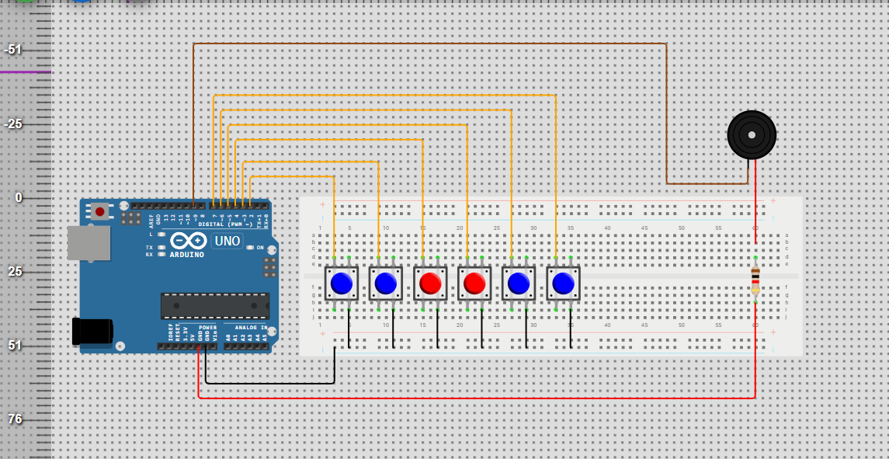

# Mini Arduino Piano

 

A 6-key Arduino-based mini piano using push buttons to play notes from C5 to A5.  
Simulated on Wokwi and built with real hardware.

## Why This Project?

This project explores basic sound generation using the Arduino `tone()` function.
It demonstrates how digital inputs (buttons) can control frequency output in embedded systems.

It was built to understand:
- Digital input handling
- Frequency generation
- Basic music theory in electronics
- Resistor configuration for audio clarity

## How It Works

Each button acts as a digital input.
When pressed, the Arduino reads HIGH and calls:

tone(buzzerPin, frequency);

The frequencies used:

C5 = 523 Hz  
D5 = 587 Hz  
E5 = 659 Hz  
F5 = 698 Hz  
G5 = 784 Hz  
A5 = 880 Hz

## Roadmap
- [x] 6 notes implemented
- [ ] Add octave switching
- [ ] Add recording mode
- [ ] Use external amplifier

## Lessons Learned
- Lower resistor values increase volume
- Frequency perception changes across notes
- Simulation vs physical hardware differences

